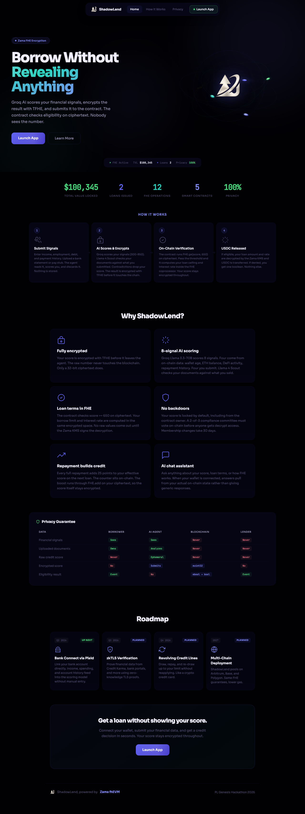

# Zalary

Every founder I know in Lagos pays remote contractors through some mix of Binance P2P, Wise, and a Telegram DM with a wallet address. Wise eats 1.5% per leg and skips most of the corridors that matter. The crypto version works, but every payment is public on Solscan. Anyone with the treasury address can read off the full payroll, including who got a raise and when.

Stablecoin payroll in emerging markets is already happening at scale. It's just done badly. Zalary is the version where privacy is built into the rail, the off-ramp is one tap, and the founder doesn't have to teach their contractor what an ATA is.



Confidential payroll for remote teams paying contractors across borders. dUSDC on Solana, salary amounts hidden on-chain via Umbra, fiat off-ramp to local currency in the same app.

**Live demo**: [zalary.vercel.app](https://zalary.vercel.app)
**Business plan**: [BUSINESS.md](./BUSINESS.md)
**Hackathon writeup**: [SUBMISSION.md](./SUBMISSION.md)
**Privacy contract**: [PRIVACY.md](./PRIVACY.md)
**Hackathon**: [Colosseum Frontier 2026](https://www.colosseum.org/frontier)

---

## How privacy works in this build

The privacy layer is Umbra, an Arcium-MXE-backed mixer on Solana. Six surfaces ship against the Umbra SDK:

1. Shielded session registration tied to the user's main wallet (one signMessage prompt, deterministic seed, no second key to manage)
2. Public-to-encrypted dUSDC deposit through Umbra's encrypted balance primitive
3. Receiver-claimable UTXO disbursement, one per employee, no on-chain employer-to-employee link
4. Employee inbox scan that decrypts incoming UTXOs only the recipient can read
5. Encrypted-to-public unshielding back into a normal ATA before off-ramp
6. Selective-disclosure compliance grants to specific auditor wallets, revocable on-chain

Full architecture in [SUBMISSION.md](./SUBMISSION.md).

## Umbra integration map

Every surface above is one SDK function call away from the wallet. Verify without cloning:

| # | Surface | Umbra primitive | File |
|---|---|---|---|
| 1 | Session registration | `getUserRegistrationFunction` | `app/src/contexts/UmbraProvider.tsx:120` |
| 2 | Public → encrypted deposit | `getPublicBalanceToEncryptedBalanceDirectDepositorFunction` | `app/src/pages/employer/ShieldedTreasuryPanel.tsx:140` |
| 3 | Encrypted → receiver-claimable UTXO | `getEncryptedBalanceToReceiverClaimableUtxoCreatorFunction` | `app/src/pages/employer/ShieldedPayrollPanel.tsx:96` |
| 4 | Inbox scan + balance decrypt | `getClaimableUtxoScannerFunction`, `getEncryptedBalanceQuerierFunction` | `app/src/components/ShieldedInbox.tsx:166`, `:145` |
| 5 | Encrypted → public unshield | `getEncryptedBalanceToPublicBalanceDirectWithdrawerFunction` | `app/src/components/ShieldedInbox.tsx:195` |
| 6 | Compliance grant issuance | `getComplianceGrantIssuerFunction` | `app/src/pages/employer/ShieldedCompliancePanel.tsx:83` |

Session keypair derivation is at `app/src/lib/umbra.ts:130` via `createSignerFromPrivateKeyBytes` over a sub-wallet deterministically derived from one `signMessage` against the user's main wallet. The wallet-standard bridge in `@umbra-privacy/sdk` v4 produced signature-verification failures on devnet, so the sub-wallet pattern is the workaround.

Client construction is at `app/src/contexts/UmbraProvider.tsx:179`, pointed at `utxo-indexer.api-devnet.umbraprivacy.com` and `relayer.api-devnet.umbraprivacy.com`.

---

## Running locally

```bash
cd app
npm install --legacy-peer-deps
npm run dev
```

You need a Phantom wallet on devnet with ~0.1 SOL. The shielded session funds itself from your main wallet via one click. Test dUSDC comes from Umbra's devnet faucet, also one click inside the app.

App runs at `localhost:5173`. Employer flow at `/employer`, employee at `/employee`.

## Project structure

```
Zalary/
├── app/
│   ├── src/
│   │   ├── contexts/UmbraProvider.tsx       Builds the Umbra client + shielded session
│   │   ├── lib/umbra.ts                     Session derivation, faucet client, devnet endpoints
│   │   ├── components/
│   │   │   ├── ShieldedInbox.tsx            Surface 4 + 5: scan + unshield (employee)
│   │   │   ├── ShieldedBalanceCard.tsx      Dashboard balance summary
│   │   │   ├── UmbraStatusPill.tsx          Registration state in the top nav
│   │   │   └── shielded/primitives.tsx      Shared UI primitives
│   │   └── pages/employer/
│   │       ├── ShieldedTreasuryPanel.tsx    Surface 2: faucet + shield
│   │       ├── ShieldedPayrollPanel.tsx     Surface 3: payroll disbursement
│   │       └── ShieldedCompliancePanel.tsx  Surface 6: auditor grants
└── dune/                        SQL queries for the Dune Frontier Data track
```

## Sponsor tracks

Submitting to Umbra, SNS Identity, Dune Frontier Data, and SuperteamNG x Raenest. Side-track status and what's shipped per track is in [SUBMISSION.md](./SUBMISSION.md).

## Privacy contract

[PRIVACY.md](./PRIVACY.md) is the line in the sand for what crosses the wire vs. what stays local. No third-party indexer in the read path. Browser-originated calls only, scoped to wallets the user controls.
