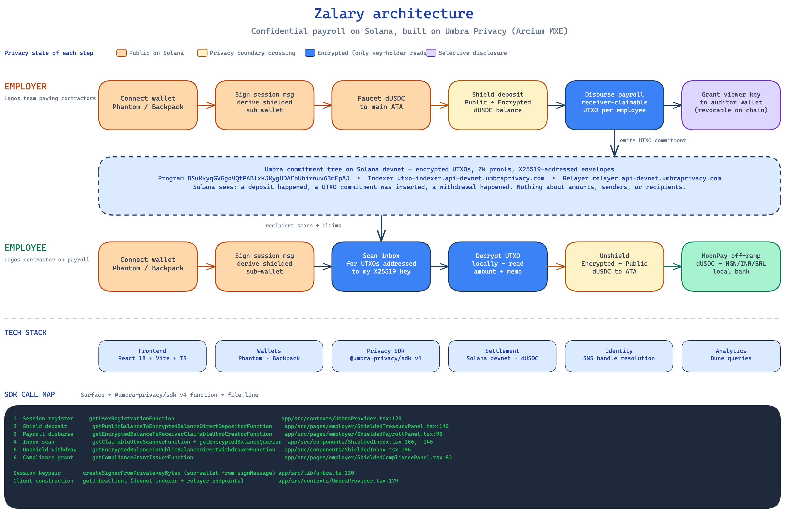

# Zalary: confidential payroll on Solana

Cross-border contractor pay with Token-2022 confidential transfer amounts. Employees cash out to local currency in the same app.

[](https://www.typescriptlang.org/)
[](https://react.dev/)
[](https://solana.com/)
[](LICENSE)



## Live Demo

**[zalary.vercel.app](https://zalary.vercel.app)**

Open as employer or employee on Solana devnet. Create a confidential mint, deposit, run payroll, then cash out.

**Docs:** [BUSINESS.md](./BUSINESS.md) · [PRIVACY.md](./PRIVACY.md) · [SUBMISSION.md](./SUBMISSION.md)  
**Hackathon:** [Colosseum Frontier 2026](https://www.colosseum.org/frontier)

---

## What Is Zalary?

Remote teams already pay contractors in stablecoins across Africa, India, and Latin America. Most of that runs through Binance P2P, Wise, or a wallet address in Telegram. Every payment is public on a block explorer.

Zalary is confidential payroll for those teams. Employers send Token-2022 confidential transfers on Solana so **amounts** stay encrypted on-chain. Employees withdraw to a public balance and off-ramp to NGN, INR, BRL, and more via MoonPay.

---

## Features

- **Confidential amounts**: Token-2022 Confidential Transfers (ElGamal + ZK proofs). Transfer amounts are not readable on explorers.
- **Honest privacy model**: Recipients remain public (native CT property). Mint auditor ElGamal key enables selective disclosure for compliance.
- **Employer dashboard**: Org roster, treasury deposit, confidential payroll run, compliance auditor key.
- **Employee portal**: Apply pending balance, withdraw to public, MoonPay cash-out.
- **Self-serve join**: Invite link with mint param. Join memo on-chain, no backend roster service.
- **Identity polish**: SNS `.sol` names, World ID nullifier path, Phantom + Privy login.

---

## Tech Stack

| Layer | Technology |
|-------|------------|
| Privacy | Token-2022 Confidential Transfers, `@solana/zk-sdk` (WASM), ZK ElGamal Proof program |
| Frontend | React 19, Vite, TypeScript, Tailwind |
| Wallet | Phantom via wallet-adapter, Privy (secondary) |
| Chain | Solana devnet, Anchor org registry program |
| Identity | World ID, SNS (Bonfida) |
| Off-ramp | MoonPay |
| RPC | Helius / public devnet |
| Hosting | Vercel |

---

## How It Works

```
Employer wallet
  |
  +-- create Token-2022 mint (ConfidentialTransferMint + auditor key)
  +-- derive ElGamal/AES keys (signMessage)
  +-- mint public cUSDC -> Deposit -> Apply pending
  +-- confidential Transfer to each employee ATA
  |
Employee wallet
  |
  +-- Apply pending -> available confidential balance
  +-- Withdraw -> public ATA -> MoonPay (NGN/INR/BRL/...)
```

| Surface | Where |
|---------|--------|
| CT session / keys | `app/src/contexts/ConfidentialProvider.tsx` |
| Mint, deposit, apply | `app/src/lib/confidential.ts`, Treasury panel |
| Payroll transfer | `ShieldedPayrollPanel.tsx` |
| Employee apply / withdraw | `ShieldedInbox.tsx` |
| Auditor key | `ShieldedCompliancePanel.tsx` |

---

## Testing the App

1. Install Phantom and switch to **Solana Devnet**. Fund ~0.1 SOL from a faucet.
2. Open [zalary.vercel.app](https://zalary.vercel.app) (or local app below).
3. Click **I'm an Employer**, connect wallet, approve `signMessage` for CT keys.
4. In the nav pill, click **Create CT mint** and wait for **Token-2022 CT: ready**.
5. **Treasury**: mint demo cUSDC, deposit, apply pending.
6. Add employees (wallet addresses that have opened Zalary once so their CT ATA is configured).
7. **Payroll**: run confidential payroll.
8. As employee: apply pending, withdraw, cash out with MoonPay (sandbox).

Invite links: `/join?org=<employer>&name=<org>&mint=<ct-mint>`.

---

## Running Locally

```bash
git clone https://github.com/ajanaku1/zalary.git
cd zalary/app
cp .env.example .env.local   # fill Helius / Privy / MoonPay as needed
npm install --legacy-peer-deps
npm run dev
```

App: `http://localhost:5173`  
Employer: `/employer` · Employee: `/employee`

---

## Project Structure

```
zalary/
├── app/                         # Vite React SPA
│   ├── src/
│   │   ├── contexts/
│   │   │   └── ConfidentialProvider.tsx
│   │   ├── lib/
│   │   │   ├── confidential.ts  # Token-2022 CT ops
│   │   │   ├── kit-wallet.ts
│   │   │   ├── send-plan.ts
│   │   │   └── program.ts      # Anchor org registry
│   │   ├── pages/employer/      # Dashboard, treasury, payroll, compliance
│   │   ├── pages/employee/      # Portal, join, income history
│   │   └── components/
│   └── vercel.json
├── docs/                        # Architecture diagram, brand assets
├── BUSINESS.md
├── PRIVACY.md
├── SUBMISSION.md
└── LICENSE
```

---

## Privacy Contract

[PRIVACY.md](./PRIVACY.md) defines what may leave the browser. Ciphertext stays on-chain. Decryption keys stay on device. No analytics indexer in the read path.

Residual leak: Token-2022 CT does not hide recipient addresses. RPC providers see which accounts you query.

---

## License

MIT
